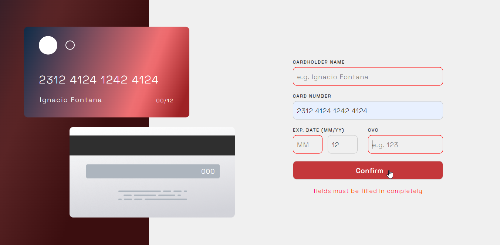

# Frontend Mentor - Interactive card details form solution

This is a solution to the [Interactive card details form challenge on Frontend Mentor](https://www.frontendmentor.io/challenges/interactive-card-details-form-XpS8cKZDWw). Frontend Mentor challenges help you improve your coding skills by building realistic projects. 

## Table of contents

- [Overview](#overview)
  - [The challenge](#the-challenge)
  - [Built with](#built-with)
  - [What I learned](#what-i-learned)
- [Author](#author)

## Overview

### The challenge

Users should be able to:

- Fill in the form and see the card details update in real-time
- Receive error messages when the form is submitted if:
  - Any input field is empty
  - The card number, expiry date, or CVC fields are in the wrong format

  ----(I decided to do things a little differently, and not allow unnecessary characters to be printed)

- View the optimal layout depending on their device's screen size
- See hover, active, and focus states for interactive elements on the page

### Screenshot

Desktop designe 
Active states 
Mobile active state 
Complete states 

### Built with

- Semantic HTML5 markup
- CSS custom properties
- Scss
- Flexbox
- JavaScript

### What I learned

learned to use regular expressions in JS
```js
numberInput.addEventListener('input', function () {
    numberInput.value = numberInput.value
      .replace(/(\d{4})(?!\s|$)/gm, `$1 `)
      .match(/(?:\d{4} ?){0,3}(?:\d{0,4})?/)
    cardNumber.textContent = numberInput.value;
});
```
first time using functions forEach and every
```js
  arr.forEach(name => {
        let maxLength = name.maxLength;
        if (name.value.length < maxLength | name.value == '') {
            name.style.border = '1px solid red';....

  if (arr.every(name => name.value.length >= name.maxLength && nameInput.value != '') == true) {
            confirmError.style.visibility = 'hidden';.....
```

## Author

- Frontend Mentor - [@Mrisee](https://www.frontendmentor.io/profile/Mrisee)


